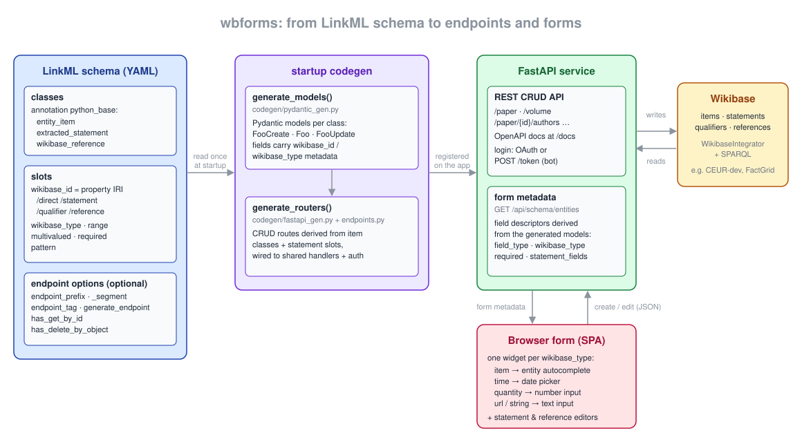

# Architecture: how endpoints and forms are generated

wbforms does not contain hand-written models, routers, or form definitions for its entity
types. Everything a user interacts with — the Pydantic models, the REST CRUD endpoints,
and the edit forms in the browser — is derived at startup from a single LinkML schema.

The input is the schema file selected by `WBFORMS_SCHEMA_PATH` (see
[configuration.md](configuration.md)); how to write such a schema is covered in
[schema-authoring.md](schema-authoring.md).

## Startup sequence

Code generation runs at **import time**:

1. `wbforms/main.py` imports `get_routers` from `wbforms.codegen`.
2. Importing `wbforms/codegen/__init__.py` reads `get_settings().schema_path` and
   immediately calls `generate_models(...)`. Every generated class is published as a
   module attribute, so `from wbforms.codegen import Paper, PaperCreate` works.
3. `main.py` calls `get_routers()` → `generate_routers(...)` and registers each returned
   `APIRouter` on the FastAPI app.

Because this happens once at import, **changing the schema (or `WBFORMS_SCHEMA_PATH`)
requires a process restart**.

## Model generation (`src/wbforms/codegen/pydantic_gen.py`)

`generate_models(schema_path)`:

1. Loads the YAML and hands it to LinkML's `SchemaView` (a legacy `endpoints:` key, used
   by older schemas, is stripped and ignored).
2. Orders classes topologically (`_topological_order`): `is_a` parents, slot-range
   classes, and `WikibaseReference` (when references are enabled) are generated before
   their dependents.
3. For each class, resolves the `python_base` class annotation (directly or from the
   `is_a` parent) against `PYTHON_BASE_INFO`:

   | `python_base` | Pydantic base | Read-model mixin | Meaning |
   |---|---|---|---|
   | `entity_item` | `EntityBase` | `ItemBase` | top-level Wikibase item with label/description/qid |
   | `extracted_statement` | `ExtractedStatement` | `Statement` | qualified statement (subject + qualifiers) |
   | `wikibase_reference` | `WikibaseReferenceBase` | `WikibaseReferenceBase` | statement-level reference block |

   A class whose `python_base` (own or inherited) is not one of these is **silently
   skipped** — no model, no endpoint, no form.

4. Builds one Pydantic field per slot (`_build_field_def`):
   - `range` maps to Python via `RANGE_TO_PYTHON` (`string`→`str`, `integer`→`int`,
     `anyuri`→`AnyHttpUrl`, `item_statement_subject`→`ItemStatementSubjectType`, …). A
     range that names another generated class becomes a statement-reference field
     (`list[Cls]` when `multivalued`).
   - The slot annotations `wikibase_id`, `wikidata_id`, and `wikibase_type` are stored in
     the field's `json_schema_extra`; `wikibase_type` values are translated to
     WikibaseIntegrator datatype names via `WIKIBASE_DTYPE_MAP` (e.g. `item` →
     `wikibase-item`). This metadata is what `WbGenerator` and the form-metadata endpoint
     read later.
   - `required`, `multivalued` (→ `list[...]` with empty-list default), and `pattern`
     (→ regex validation) are honored.
   - A slot whose `wikibase_id` path contains `/statement/` is the **statement subject**;
     it is forced optional and defaults to the Wikibase "unknown value" sentinel.
   - Slot annotations are merged from the global slot definition, the induced slot, and
     the class's `slot_usage` (which wins) — see `_slot_annotations`. This matters because
     LinkML's `induced_slot` *replaces* annotations instead of merging them.
5. Applies class-level options: `model_title` (Pydantic model title),
   `enforce_unknown_stmt_name` (surfaced to the frontend), and `supports_references`
   (adds a `sources: list[WikibaseReference]` field; a slot-level opt-in instead adds a
   sibling `<slot>_sources` field).
6. Emits **four classes per schema class**:
   - `FooBase` — shared field definitions,
   - `FooCreate` — request body for POST (no QID),
   - `FooUpdate` — all-optional partial model for PUT (via `make_partial_model`),
   - `Foo` — read/response model (adds `qid`, statement ids, etc. through the mixin).

## Router generation (`src/wbforms/codegen/fastapi_gen.py` + `endpoints.py`)

Endpoints are **derived from the schema classes** by
`derive_endpoints(schema_path)` in `src/wbforms/codegen/endpoints.py` (cached per
schema path). The conventions:

- every `entity_item` class `Foo` → an **item endpoint** at `/foo` with path parameter
  `foo_id`;
- every statement-reference slot on an item class (including **inherited** slots, so
  subclasses get their own mounts) → a **statement endpoint** at
  `/foo/{foo_id}/<slot name>`.

Optional class/slot annotations (`endpoint_prefix`, `endpoint_segment`, `endpoint_tag`,
`generate_endpoint: false`, `has_get_by_id`, `has_delete_by_object`) override the
conventions — see [schema-authoring.md](schema-authoring.md) § 6.

`generate_routers(schema_path, models)` turns each derived definition into an
`APIRouter`:

- **item** (`_item_router`) → `POST /`, `GET /{id_param}`, `PUT /{id_param}`,
  `DELETE /{id_param}` under the derived prefix.
- **statement** (`_statement_router`) → `GET ""` (list), `POST /`,
  `PUT /{statement_id}`, `DELETE /{statement_id}`; optionally `GET /{statement_id}`
  (`has_get_by_id`) and `DELETE /` by `object_named_as` (`has_delete_by_object`).

Implementation notes:

- Handlers are generic `**kwargs` functions wrapped by `_make_handler`, which attaches a
  synthetic `__signature__` so FastAPI can introspect path parameters, the body model,
  and dependencies as if the function were hand-written.
- Every route depends on `get_current_user`, which resolves the bearer token to an
  authenticated `WikibaseSession` — all generated endpoints require login.
- Item/parent ids are validated against the pattern `Q\d+`.
- The routes delegate to the shared CRUD handlers in `src/wbforms/api/utils.py`
  (`handle_item_creation`, `handle_statement_update`, …), which in turn use
  `src/wbforms/wbgenerator.py` to translate between the Pydantic models and
  WikibaseIntegrator `ItemEntity` objects. The `wikibase_id` / `wikibase_type` metadata
  stored on each field tells `WbGenerator` which property to write and which snak
  datatype to use.

## Form metadata: `GET /api/schema/entities`

The SPA does **not** parse the OpenAPI document. It consumes a bespoke endpoint in
`src/wbforms/api/frontend.py` (`get_schema_entities` → `_build_entity_schema`) that
returns, per item-type endpoint, a list of field descriptors:

- `name`, `label` (currently just the title-cased slot name), `required`
- `field_type`: `single`, `list` (multivalued slot), or `statement_list` (slot whose
  range is a statement class)
- `wikibase_type`: the WikibaseIntegrator datatype (`wikibase-item`, `time`, `quantity`,
  `url`, …) that drives widget selection
- for `statement_list` fields: `statement_model`, `statement_endpoint` (the matching
  statement route prefix), `statement_fields` (nested descriptors, with `is_subject` /
  `is_object_named_as` markers), `enforce_unknown_stmt_name`, `supports_references`, and
  `reference_fields`
- `label` and `description` are always injected as the first text inputs; they are
  required unless the schema declares them as optional slots (see
  [schema-authoring.md](schema-authoring.md) § 3). Internal fields
  (`qid`, `statement_id`, `sources`, `rdfs:label`, …) are filtered out.

The metadata builder uses the same `derive_endpoints()` output as the router generator:
each derived statement endpoint records the `(parent_model, slot)` pair it was created
from, so every statement field is linked to its REST route exactly — routers and form
metadata cannot go out of sync.

## Form rendering (SPA)

The static Vue 3 SPA (`src/wbforms/static/`, no build step) fetches
`/api/schema/entities` and renders one form per entity type:

- `FieldInput.js` picks the widget from `wikibase_type`: `wikibase-item` →
  `ItemSearchInput` (autocomplete backed by the `/api/entity-search` proxy), `time` →
  `DateTimeInput`, `quantity` → number input, `url` → url input, everything else → text
  input. `field_type: list` adds add/remove controls per value.
- `StatementListEditor.js` renders `statement_list` fields as editable rows of qualified
  statements; `SourceBlockEditor.js` renders reference blocks when
  `supports_references` is set.
- `CommitDialog.js` diffs the edited state against the loaded entity and issues the
  minimal set of REST calls (PUT on the item, POST/PUT/DELETE per statement). The exact
  update semantics are documented in [update-behavior.md](update-behavior.md).
